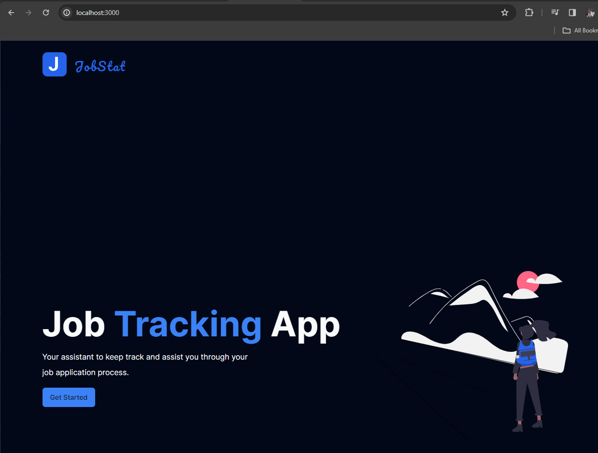
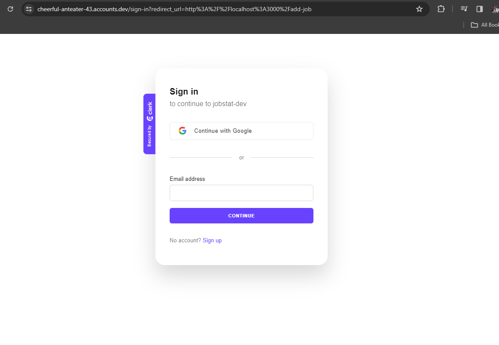
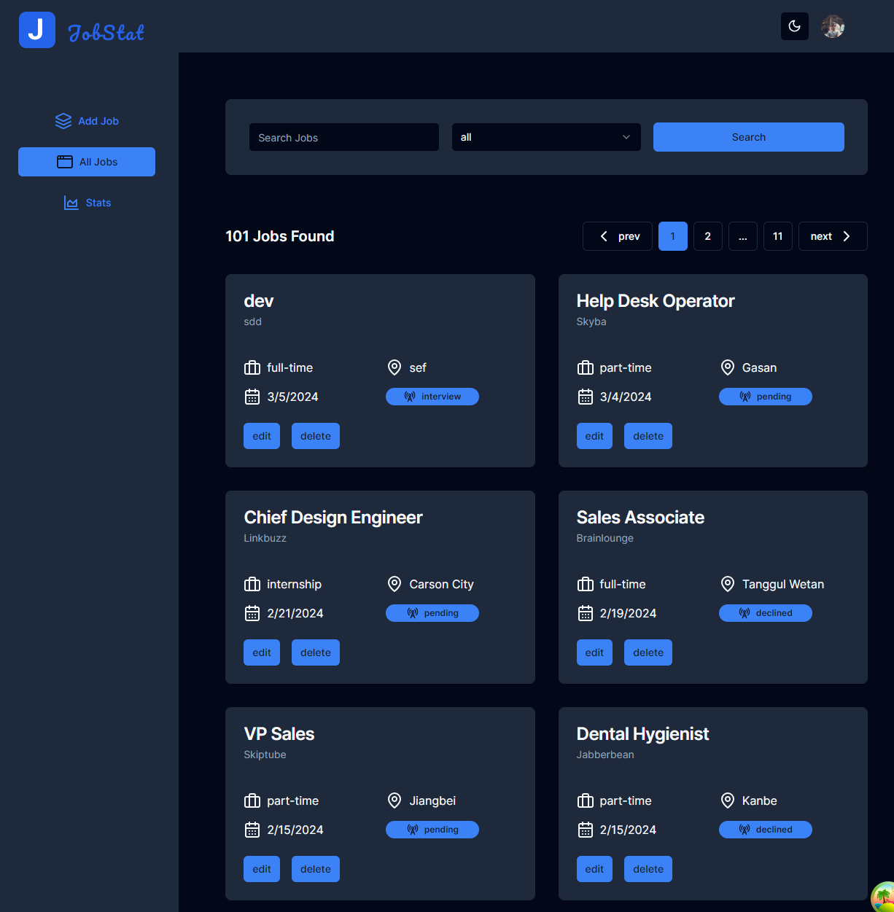
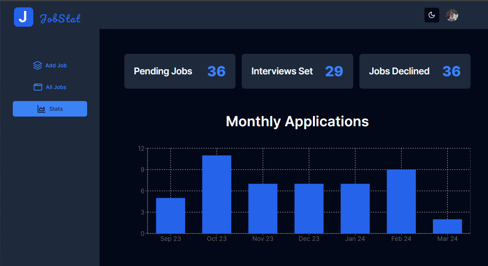
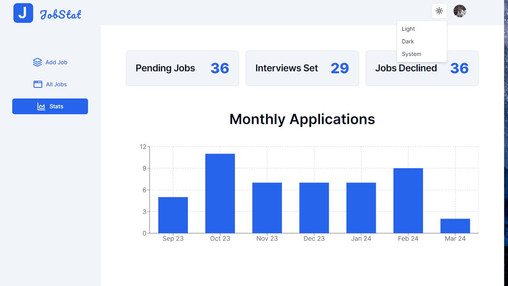

# jobstat
JobStat is a job tracking application designed to assist job seekers in managing and tracking their job application process effectively. It provides an intuitive interface for adding, managing, and monitoring job applications with various statuses like pending, interview, and declined.


## Features

- **Job Tracking**: Keep a record of all the jobs you have applied for with details such as position, company, and location.

- **Status Updates**: Update the status of your job applications to reflect their current state, such as pending, interview set, or declined.



- **Statistics**: Visualize your job application process with charts that display monthly application statistics.

- **Responsive Design**: A user-friendly interface that adapts to different screen sizes for a seamless experience on any device.
- **Dark Mode**: A dark theme for those who prefer a darker color palette for reduced eye strain and better readability in low-light conditions.


## Getting Started

To get started with JobStat, clone the repository and install the dependencies:

```bash
git clone https://github.com/kndesai/jobstat.git
cd jobstat
npm install
